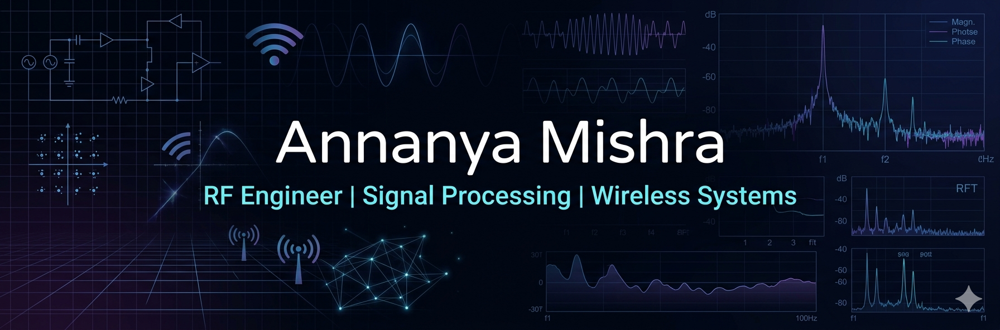

<!-- 🔥 Banner -->

<p align="center">
  
</p>

<h1 align="center">Annanya Mishra</h1>

<p align="center">
📡 RF & Embedded Systems Engineer <br>
🔬 Signal Processing | Wireless Systems | Sensor Technology
</p>

<p align="center">
<i>"Designing, analyzing, and understanding signals that power modern communication."</i>
</p>

---

## 📡 Signal Flow

```
Signal → Noise → FFT → Feature Extraction → ML → Insight
```

---

## 🔬 Waveform Insight

```
~ ~ ~ ~ ~ ~ ~ ~ ~ ~ ~ ~ ~
   RF Signal Processing
~ ~ ~ ~ ~ ~ ~ ~ ~ ~ ~ ~ ~
```

---

## 📊 GitHub Analytics

<p align="center">
  
  
</p>

<p align="center">
  
</p>

---

## 🧠 Engineering Domains

| Domain             | Focus                     |
| ------------------ | ------------------------- |
| 📡 RF Systems      | AM, FM, BPSK, QPSK, OFDM  |
| 📊 Signal Analysis | FFT, Spectrum Analysis    |
| 🌐 Wireless        | Communication Systems     |
| 🔌 Embedded        | Raspberry Pi + Sensors    |
| 🤖 Data            | Dataset Generation for ML |

---

## 🧪 Active Projects

### 🚀 RF Signal Simulation & Dataset Generator

* Multi-modulation signal generation
* Noise modeling (AWGN, Fading)
* FFT spectrum analysis
* ML-ready dataset

---

### 📡 Radar System (Raspberry Pi)

* Servo-based scanning
* Object detection mapping
* Real-time visualization

---

### 🌡️ Sensor Monitoring System

* DHT22 + LCD integration
* Data logging & plotting
* Embedded system design

---

## 🧰 Tech Stack

<p align="center">


<br>


</p>

---

## 📂 Engineering Architecture

```
rf-signal-simulation/
 ├── src/
 ├── data/
 ├── plots/
 ├── results/
 └── README.md
```

---

## 🎯 Engineering Mindset

* Think in signals and systems
* Analyze before implementing
* Build research-oriented solutions

---

## 📈 Future Direction

* RF Research
* Wireless Communication Systems
* AI in Signal Processing

---

## 📫 Contact

* LinkedIn: (https://www.linkedin.com/in/annanya-mishra-9368961b3/)
* Email: (annanyamishra1011@gmail.com)

---

<div align="center">

⚡ *"Understand the signal, control the system."*

</div>
